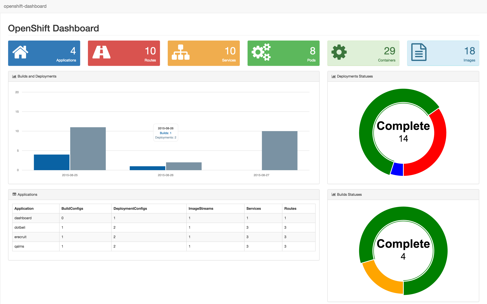

# OpenShift Dashboard

**Dashboard for visualization of multi-projects resources in OpenShift.**

[](https://godoc.org/github.com/vbehar/openshift-dashboard)
[](https://travis-ci.org/vbehar/openshift-dashboard)
[](https://circleci.com/gh/vbehar/openshift-dashboard/tree/master)

This is a web application that aims to display a nice dashboard of your resources across multiple projects in an [OpenShift](http://www.openshift.org/) instance.



## How It Works

It is a [Go](http://golang.org/) webapp that uses the OpenShift API to build a dashboard, based on [Start Bootstrap - SB Admin 2](https://github.com/IronSummitMedia/startbootstrap-sb-admin-2).

* If the application is running in a container **in an OpenShift Cluster**, it will connect to the OpenShift API Server using the information available from the environment (mainly the service account token secret).

* If the application is not running in an OpenShift Cluster, it uses the default configuration file to connect to the OpenShift API Server. So it requires that you **login with the `oc` client** before starting the application.

## Running locally

If you want to run it on your laptop:

* clone the sources in your GOPATH

	```
	git clone https://github.com/vbehar/openshift-dashboard.git $GOPATH/src/github.com/vbehar/openshift-dashboard
	```
* install 
	* [godep](https://github.com/tools/godep): for using the vendored dependencies

	  ```
	  go get github.com/tools/godep
	  ```
	* [gin](https://github.com/codegangsta/gin): for live-reloading the web server

	  ```
	  go get github.com/codegangsta/gin
	  ```
* configure the environment (in dev mode, caching is disabled)

  ```
  echo "GO_ENV=dev" > $GOPATH/src/github.com/vbehar/openshift-dashboard/.env
  ```
* Login with the `oc` client: it will create a config file that will be used by the dashboard app to connect to the OpenShift API.

	```
	oc login [...]
	```
* start the web server on port 8080 (don't forget the `--godep` option, to use `godep` to retrieve the vendored dependencies)

	```
	gin --godep --port 8080 run main.go
	```
* open <http://localhost:8080/>

## License

Copyright 2015 the original author or authors.

Licensed under the Apache License, Version 2.0 (the "License");
you may not use this file except in compliance with the License.
You may obtain a copy of the License at

    http://www.apache.org/licenses/LICENSE-2.0

Unless required by applicable law or agreed to in writing, software
distributed under the License is distributed on an "AS IS" BASIS,
WITHOUT WARRANTIES OR CONDITIONS OF ANY KIND, either express or implied.
See the License for the specific language governing permissions and
limitations under the License.
